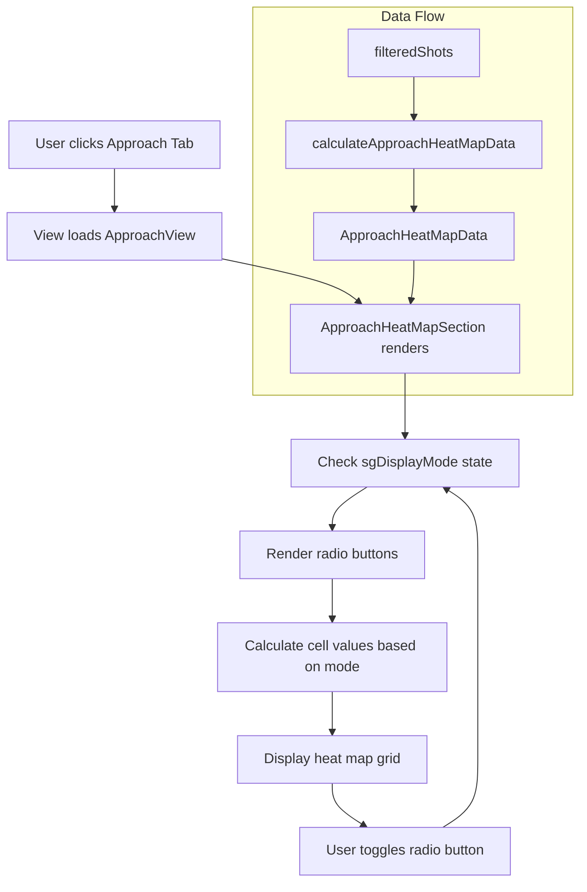

# Approach Heat Map Plan

## Overview
Add a heat map visualization to the Approach tab that shows approach shot performance by:
- **X-axis**: Approach distance buckets (51-100, 101-150, 151-200, 201-225 yards)
- **Y-axis**: Starting Lie (Tee, Fairway, Rough, Sand, Recovery)
- **Cell values**: Total shots per bucket combination
- **Toggle**: Radio buttons for "Total SG" vs "SG per Round"

## Requirements Confirmed
1. **SG per Round**: Average = Total SG ÷ Number of Rounds in filter
2. **Starting Lie**: Include all 5: Tee, Fairway, Rough, Sand, Recovery (show empty if no shots)
3. **Distance Buckets**: Use existing buckets (51-100, 101-150, 151-200, 201-225 yards)
4. **Empty cells**: Show nothing (blank) if no shots in that bucket combination

## Data Flow

### 1. Type Definition (src/types/golf.ts)
Add new interface for heat map data:

```typescript
export interface ApproachHeatMapCell {
  lie: string;                    // Tee, Fairway, Rough, Sand, Recovery
  distanceBucket: string;          // Distance Wedges, Short Approach, etc.
  minDistance: number;
  maxDistance: number;
  totalShots: number;
  strokesGained: number;
  sgPerRound: number;             // strokesGained / totalRounds
}

export interface ApproachHeatMapData {
  cells: ApproachHeatMapCell[];
  distanceBuckets: string[];       // X-axis labels
  lies: string[];                  // Y-axis labels (Tee, Fairway, Rough, Sand, Recovery)
  totalRounds: number;            // For SG per Round calculation
}
```

### 2. Calculation Function (src/utils/calculations.ts)
Create `calculateApproachHeatMapData(shots, totalRounds)`:

- Filter to approach shots only (`shotType === 'Approach'`)
- Group by Starting Lie (Tee, Fairway, Rough, Sand, Recovery)
- For each lie, further group by distance bucket
- Calculate for each cell:
  - `totalShots`: Count of shots
  - `strokesGained`: Sum of calculatedStrokesGained
  - `sgPerRound`: strokesGained / totalRounds

### 3. Hook Integration (src/hooks/useGolfData.ts)
- Import the new type and function
- Add `approachHeatMapData` to the return value
- Calculate using: `calculateApproachHeatMapData(filteredShots, uniqueRoundCount)`

### 4. Component Implementation (src/App.tsx)
Add `ApproachHeatMapSection` component inside `ApproachView`:

```typescript
function ApproachHeatMapSection({ 
  data, 
  displayMode // 'total' | 'perRound' 
}: { 
  data: ApproachHeatMapData; 
  displayMode: 'total' | 'perRound';
}) {
  // State for radio button toggle
  const [sgDisplayMode, setSgDisplayMode] = useState<'total' | 'perRound'>('total');
  
  // Render heat map table
  // - Header row: distance buckets
  // - Row headers: Starting Lie
  // - Cells: total shots (empty if 0)
  // - Color coding based on SG value
}
```

### 5. Heat Map Visualization Details

**Structure**:
- Grid with 5 rows (Tee, Fairway, Rough, Sand, Recovery) × 4 columns (distance buckets)
- Each cell displays: Total shots count
- Empty cells: Show nothing (blank)

**Color Coding**:
- Use stroke gained color scale for cell backgrounds or text
- Or use intensity-based coloring (darker = more shots)

**Radio Button**:
- Position: Above the heat map, left-aligned
- Options:
  - "Total SG" (default) - shows total strokes gained
  - "SG per Round" - shows average per round

### 6. Integration in ApproachView
Add the new section after existing approach sections:
- After "Approach from Rough" section
- Or create a new tabbed/sectioned area

## Mermaid Diagram



## Files to Modify

| File | Changes |
|------|---------|
| `src/types/golf.ts` | Add `ApproachHeatMapCell` and `ApproachHeatMapData` interfaces |
| `src/utils/calculations.ts` | Add `calculateApproachHeatMapData` function |
| `src/hooks/useGolfData.ts` | Add `approachHeatMapData` to hook return |
| `src/App.tsx` | Add `ApproachHeatMapSection` component and integrate into `ApproachView` |

## Implementation Notes

1. **Round Count**: Get unique round IDs from filtered shots for SG per Round calculation
2. **Starting Lie**: Extract unique Starting Lie values from approach shots (may not have all 5)
3. **Empty Handling**: If `totalShots === 0`, render empty cell (no content)
4. **Display Mode**: Toggle changes which metric is displayed in cells - total shots is always shown as the cell value
5. **Color Scale**: Reuse existing `getStrokeGainedColor` function for coloring

## Acceptance Criteria

- [ ] Heat map displays 5 rows (Tee, Fairway, Rough, Sand, Recovery) 
- [ ] Heat map displays 4 columns (distance buckets)
- [ ] Each cell shows total shot count (or empty if 0)
- [ ] Radio buttons toggle between Total SG and SG per Round
- [ ] When toggled, cell values update to show appropriate metric
- [ ] Empty cells show nothing (no "0" or other placeholder)
- [ ] Heat map integrates seamlessly with existing Approach tab layout
