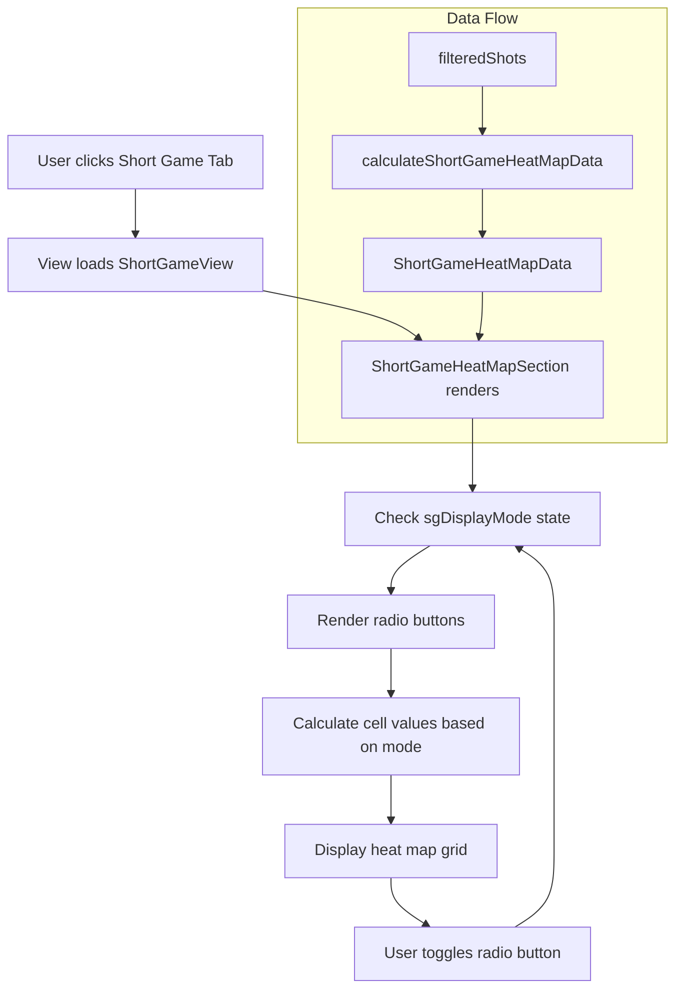

# Short Game Heat Map Plan

## Overview
Add a heat map visualization to the Short Game tab that mirrors the Approach tab heat map but uses short game-specific distance buckets:

- **Y-axis**: Starting Lie (Fairway, Rough, Sand, Recovery) - Note: No Tee for short game
- **X-axis**: Distance buckets:
  - 0-15 yards: Around the Green
  - 16-35 yards: Short Shots  
  - 36-50 yards: Finesse Wedges
- **Cell values**: Total shots per bucket combination + SG metrics
- **Toggle**: Radio buttons for "Total SG" vs "SG per Round"

## Requirements Confirmed
1. **SG per Round**: Average = Total SG ÷ Number of Rounds in filter
2. **Starting Lie**: Include 4: Fairway, Rough, Sand, Recovery (no Tee since these are short game shots)
3. **Distance Buckets**: 
   - Around the Green: 0-15 yards
   - Short Shots: 16-35 yards
   - Finesse Wedges: 36-50 yards
4. **Empty cells**: Show nothing (blank) if no shots in that bucket combination

## Data Flow

### 1. Type Definition (src/types/golf.ts)
Add new interfaces for heat map data:

```typescript
export interface ShortGameHeatMapCell {
  lie: string;                    // Fairway, Rough, Sand, Recovery
  distanceBucket: string;          // Around the Green, Short Shots, Finesse Wedges
  minDistance: number;
  maxDistance: number;
  totalShots: number;
  strokesGained: number;
  sgPerRound: number;             // strokesGained / totalRounds
}

export interface ShortGameHeatMapData {
  cells: ShortGameHeatMapCell[];
  distanceBuckets: string[];       // X-axis labels
  lies: string[];                  // Y-axis labels (Fairway, Rough, Sand, Recovery)
  totalRounds: number;            // For SG per Round calculation
}
```

### 2. Calculation Function (src/utils/calculations.ts)
Create `calculateShortGameHeatMapData(shots, totalRounds)`:

- Filter to short game shots only (`shotType === 'Short Game'`)
- Group by Starting Lie (Fairway, Rough, Sand, Recovery)
- For each lie, further group by distance bucket:
  - Around the Green: 0-15 yards
  - Short Shots: 16-35 yards
  - Finesse Wedges: 36-50 yards
- Calculate for each cell:
  - `totalShots`: Count of shots
  - `strokesGained`: Sum of calculatedStrokesGained
  - `sgPerRound`: strokesGained / totalRounds

### 3. Hook Integration (src/hooks/useGolfData.ts)
- Import the new type and function
- Add `shortGameHeatMapData` to the return value
- Calculate using: `calculateShortGameHeatMapData(filteredShots, uniqueRoundCount)`

### 4. Component Implementation (src/App.tsx)
Add `ShortGameHeatMapSection` component inside `ShortGameView`:

```typescript
function ShortGameHeatMapSection({ 
  data, 
  displayMode // 'total' | 'perRound' 
}: { 
  data: ShortGameHeatMapData; 
  displayMode: 'total' | 'perRound';
}) {
  // State for radio button toggle
  const [sgDisplayMode, setSgDisplayMode] = useState<'total' | 'perRound'>('total');
  
  // Render heat map table (reuse similar structure from ApproachHeatMapSection)
  // - Header row: distance buckets
  // - Row headers: Starting Lie
  // - Cells: total shots count + SG value
  // - Color coding based on SG value
}
```

### 5. Heat Map Visualization Details

**Structure**:
- Grid with 4 rows (Fairway, Rough, Sand, Recovery) × 3 columns (distance buckets)
- Each cell displays: Total shots count + SG value
- Empty cells: Show nothing (blank)

**Color Coding**:
- Reuse the same `getHeatMapColor` function from ApproachHeatMapSection

**Radio Button**:
- Position: Above the heat map, left-aligned
- Options:
  - "Total SG" (default) - shows total strokes gained
  - "SG per Round" - shows average per round

### 6. Integration in ShortGameView
Add the new section after existing short game sections:
- After existing stats cards section

## Mermaid Diagram



## Files to Modify

| File | Changes |
|------|---------|
| `src/types/golf.ts` | Add `ShortGameHeatMapCell` and `ShortGameHeatMapData` interfaces |
| `src/utils/calculations.ts` | Add `calculateShortGameHeatMapData` function |
| `src/hooks/useGolfData.ts` | Add `shortGameHeatMapData` to hook return |
| `src/App.tsx` | Add `ShortGameHeatMapSection` component and integrate into `ShortGameView` |

## Implementation Notes

1. **Shot Type**: Filter to `shotType === 'Short Game'`
2. **Distance**: Short game distances are in yards (0-50 yards)
3. **Starting Lie**: Only Fairway, Rough, Sand, Recovery (no Tee)
4. **Empty Handling**: If `totalShots === 0`, render empty cell (no content)
5. **Display Mode**: Toggle changes which metric is displayed in cells - total shots is always shown
6. **Color Scale**: Reuse existing `getHeatMapColor` function from ApproachHeatMapSection
7. **Reusable Component**: Consider extracting a generic HeatMapSection component that can be used by both Approach and Short Game

## Acceptance Criteria

- [ ] Heat map displays 4 rows (Fairway, Rough, Sand, Recovery) 
- [ ] Heat map displays 3 columns (Around the Green, Short Shots, Finesse Wedges)
- [ ] Each cell shows total shot count + SG value
- [ ] Radio buttons toggle between Total SG and SG per Round
- [ ] When toggled, cell values update to show appropriate metric
- [ ] Empty cells show nothing (no "0" or other placeholder)
- [ ] Heat map integrates seamlessly with existing Short Game tab layout
